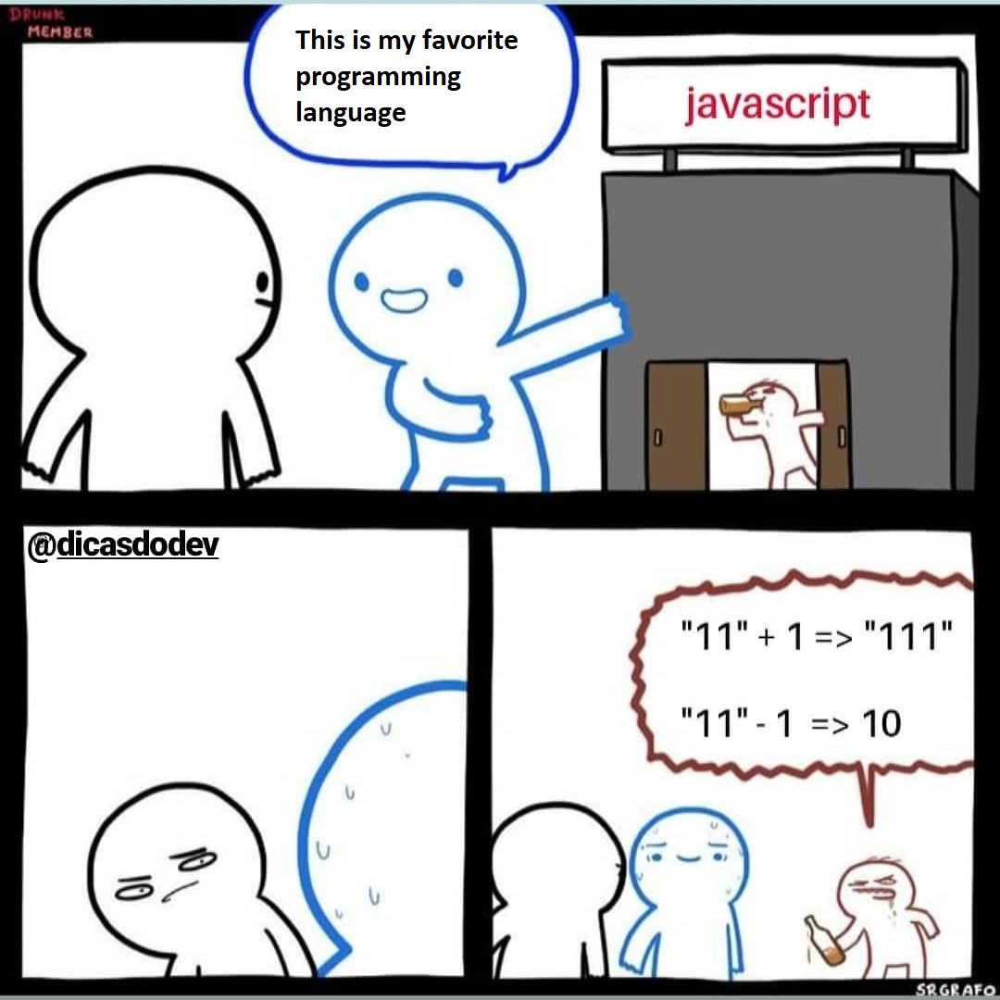

<!--:::{
  "post_title": "Utilizar Type Coercion para criticar JS não te faz parecer inteligente",
  "post_description": "Coerce é um aspecto legado do JS que visava trazer resiliencia a linguagem. Vamos entender melhor porque essa coisa contra-intuitiva existe no JS e porque tanta gente entende isso errado.",
  "post_created_at": "Fri Mar 10 2023 15:50:04 GMT-0300 (Brasilia Standard Time)"
}:::-->

Type Coercion (ou coerce, para os intimos) é o cast automático ou implícito entre diferentes tipos em uma expressão. Basicamente o que acontece quando vc faz `11 + "1" === "111" // true` em JS. E sim, essa expressão está correta. Veja o quadrinho abaixo:

 

O que aconteceu aí é o seguinte:

O JS vai ler a expressão para resolver o resultado, o type coerce vai tentar forçar a resolução da expressão custe o que custar pra manter sua pág funcionando mesmo que haja uma pequena inconsistencia conceitual da sua parte.

Quando o parser encontrar um operador valido numa expressão multi-typing, vai normalizar os tipos até resolver a expressão. Como vc somou uma string com um numero, o tipo que prevalece é a String e o operador + vai forçar o coerce de 1 para "1" fazendo concatenação afim de resolver a expressão.

Mas quando se trata de subtração vc não pode forçar "desconcatenação" com um operador negativo numa expressão que começa com uma String, o JS não pode arrancar char da string (até pq ela é constante e imutable). Como vc não pode "decrementar" de String, então o coerce é esperto o bastante para fazer o cast da String para Number afim de resolver a expressão a qualquer custo:

"11" + 1 = String(11) coerce("11"+1) = String(11) + String(1) = "111"

e

"11" - 1 = String(11) coerce("11"-1) = Number(11) - 1 = 10

Isso é definido pela premissa "Dont break the web", o que significa que a linguagem deve ser flexivel o bastante para deixar a runtime continuar mesmo que o dev aparentemente não saiba o que está fazendo como o caso dos codigos nos exemplos. Isso pq JS é singlethread by design e no começo da web nem se falava em multithread, daí ja pensou sua pagina inteira quebrando e sem carregar pq um nocego tacou um "11" + 1 em algum lugar? hahaha

Lembrando que: type coercion não é pra ser usado como feature. É "errado" sair tacando multi-typed expressions no seu codigo, vai ser contra intuitivo, vai te dar problemas. Isso existe por conta do historico evolucional da web e só. Na dúvida, prefira TS então.

Referencia se vc quiser saber mais sobre type coercion:

https://developer.mozilla.org/en-US/docs/Glossary/Type_coercion

Eu não quero aqui defender JS a todo custo, pq tem varios pontos bostas e langs MUITO mais robustas mesmo. Mas não é interessante clamar uma virtude que não existe sobre um aspecto que não é de fato o problema que parece ser. Por isso vc não vai parecer inteligente tentando danificar a imagem de uma linguagem de programação estabelecida criticando esse aspecto, na verdade vai mostrar que você não sabe muito bem do que está falando. "Ah mas piadas sobre coerce são engraçadas ué!". Sim, são mesmo hehuehuehue, o que é complicado é levar elas a sério e achar que são demonstração de perícia técnica quando: bem, não.

"Mas então eu sou obrigado/a a gostar do coerce sendo que esse troço é contra intuitivo, esquisito e me parece muito errado?""

Não, você não é. Ninguém é, e de fato coerce é complicado e leva a problemas reais. A questão do coerce não é que alguem vai colocar na runtime `1 + "11"` mas é que expressões como essa podem surgir expontaneamente e não vão estourar erros na runtime. Isso é complicado porque leva a comportamentos inesperados e bugs difíceis de tracker. E sim: isso é uma merda. Porém, antes de fazer uma piada para parecer o mais inteligente dos Devs, isso também teve uma razão de existir:

O motivo por detrás disso na época era o "dont break the web", ou seja: sua pagina deveria rodar o maximo possivel sem freeze mesmo com erro (senão seria muito ruim a experiencia de navegação). Desse modo o coerce surgiu como um dispositivo de "resiliencia". 

Considere que o JS rodava a principio "client-only", assim considere também: multi device, backward-compatibility, multiple vendors, runtimes diferentes (lembra ter que dar suporte pra IE, Firefox e Chrome que rodavem runtimes diferentes), nenhuma padronização, nenhuma governança, etc. Era quase impossivel garantir um codigo web 100% sem erros, se tudo estourasse nehuma pagina abriria

eu acho que o melhor mais proximo disso teria sido implementar error boundaries então (o que é ok), de resto complica mais ainda o JS sendo single threaded by default, é simples pra um erro besta causado pq nao havia coerce derrubar uma pag. inteira por ex :( Seria impossivel garantir que um codigo iria rodar EM TODO lugar de forma limpa e sem erros igual no seu ambiente, mesmo com testes, mesmo com type checking, porque poderia haver uma variação de runtime e pronto, sua página não abre mais.

Olhando por esse lado quando porcaria ou desatenção quebraria uma página no meio ou geraria um freeze nela. Sendo JS single threaded então, isso se agrava. Se vc abrir qualquer pagina web e acompanhar o console dando permisssão pra ele mostrar todos os erros e warnings, verá que a internet é na verdade uma grande gambiarra. Ao trazer uma robustez absurda, talvez fosse impossível manter uma pagina navegável por muito tempo... Daí o coerce ser essa faca de dois gumes: ele fode sua experiencia de desenvolvimento, mas garante resiliencia para o software no meio de uma terra sem lei.

Conforme a internet evoluiu e JS foi ganhando importancia, padronização, governança, isso começou a fazer menos sentido. E agora o coerce é apenas um entulho que enxe o saco ali no meio da linguagem. Com a vinda do TS então, isso ficou ainda mais latente. E daí entra um novo clamor:

`Seria bom se tivéssimos outra linguagem para o Front então`

Esse é um segundo clamor ingênuo. Uma vez eu fiz uma thread sobre isso e o proprio brendan eich respondeu algo bem interessante sobre: todas as langs terminariam macetadas igual o JS: <a href="/posts/what-brendan-eich-said-about-js-replacement/" target="_blank">O que Brendan Eich disse sobre a hipotese imaginária de substituir o JS por outra linguagem no Front, uma Aula gratuita via Twitter</a>.

Basicamente o ponto do Brendan é que qualquer linguagem seria amaldiçoada pelo fardo de rodar num client multi-device com `backeward compatibility` e `dont break the web` principles nas costas. Fatalmente todas terminariam mais ou menos igual o JS (umas melhores, outras piores, mas bem próximas).

TS é o próprio exemplo disso. TS dá certo pq é mantido por um unico vendor e compila pra JS que já garante backward compatibility. Quer matar o TS? Coloca ele nativo nos browsers forçando cada vendor pra manter sua própria runtime: ta feita a merda.

Espera só pra ver o que a Apple ia fazer com um TS nativo no Safari HAHAHA, o que a Google ia implementar de diferente para tudo que ela não concorda, ou como a mozilla ia criar uma nova SPEC de tipos para o TS no browser pq não concorda com a visão da google. Some a isso: Multi device, backward compatibility e dont break the web para o mantenimento e voilá: fodeu. JS carrega isso nas costas e TS pode trabalhar em pás (digo, paz...).

Aliás, essa é uma das maiores forças do TS, tão importante quando o próprio type system: É mantido por um UNICO vendor e tem uma especificação centralizada com um output padrão não importa quem rode, desde que propriamente configurado.

Novamente: não quero aqui martirizar e trazer uma visão romantica de que JS é lindo e maravilhoso. Apenas colocar "cada lugar na sua coisa": algumas merdas tem razão de ser. Se vc quer muito criticar JS, aqui vão alguns pontos interessantes:

. Single threaded by design (shit)

. API de datas roubada do Java (acho que da dec. de 90.. 80 sei lá) e nunca mais atualizada. Estão criando uma API nova chamada "Temporal" pra substituir.

. limite matematico pobre

. muito tempo sem governança e padronização, portanto carrega um monte de lixo

. object null é uma aberração (null é um objeto e pode ser entendido como vazio pero no mucho)

E por aí vai. Tem bastante coisa que dá pra usar pra falar mal de JS de verdade. Tem linguagens muito mais robustas pra se utilizar principalmente no backend a depende da sua necessidade em robustez, type/code safety e da velocidade que vc tem pra dispender. Dá também pra fazer um monte de piadinha sobre JS e o coerce (que é tenso mesmo). O que não da pra fazer é se achar uma virtuosi da programação achando que descobriu um """bug""" quando simplesmente vc tá frente a um comportamento que vc não entende. Se vc ainda for curioso e quiser ver uma cacetada de "problemas" de coerce e comportamentos absurdos e suas explicações, tem um repo só disso: <a href="https://github.com/denysdovhan/wtfjs" target="_blank">WTFJS</a>. 

E se depois de tudo isso vc me disser: `Ok, mas e isso aqui hein 0.1 + 0.2 === 0.3 // false`. Isso já é outro assunto e é basicamente um bug de quase toda linguagem de programação (algumas tem workarounds que evitam vc experienciar este bug, mas ele está lá. Outras (como JS, Python etc) não tem nem isso). Aqui você pode ler um pouco mais sobre o chamado `Floating Point Problem`: <a href="https://0.30000000000000004.com/" target="_blank">0.30000000000000004.com</a>