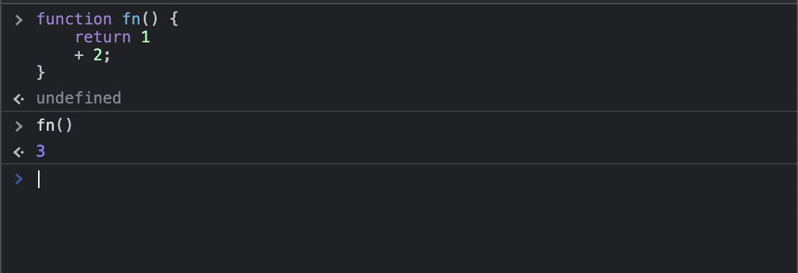
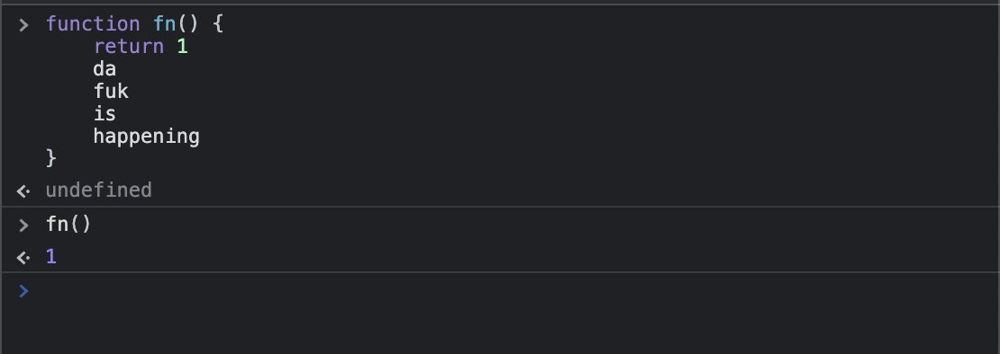

<!--:::{
  "post_title": "Quando uma função acaba para o interpretador JS?",
  "post_description": "Vamos tratar aqui de 3 questões simples: 1. ASI - Automatic Semicolon Insertion. 2. 'End of Function' e maneiras de interpreta-las. 3. Unreachable Code",
  "post_created_at": "Thu May 04 2023 16:13:36 GMT-0300 (Brasilia Standard Time)"
}:::-->

Sem olhar em lugar nenhum, sem testar, simplesmente batendo o olho na função JS abaixo, se vc a executasse, o que ela retornaria?

```javascript
function fn() {
  return 
      1 
      2
}
```

Bom, fiz essa pergunta e 65% dos votantes responderam incorretamente. A resposta correta é "undefined". Nessa thread eu vou explicar em detalhes o que tá acontecendo aí e mostrar umas doideiras do JS interpreter.


A ideia dessa poll não foi mostrar gambiarra em JS, mas abrir precedente para explicação de conceitos avançados. Vamos tratar aqui de 3 questões simples:

1. ASI - Automatic Semicolon Insertion
2. "End of Function" - Quando uma função termina?
3. Unreachable Code

Bom, o primeiro ponto é: JS por padrão necessita de ; porém elas são colocadas automaticamente pela ASI - Automatic Semicolon Insertion - então podemos simplesmente omiti-las. Porém, para a ASI, o código que vc viu seria interpretado assim:

```javascript
function fn() {
  return ;
      1;
      2;
}
```

Se vc notar então, temos um return vazio, seguido de valores arbitrários. Esses valores são lexicalmente validos, então o interpretador caga pra eles. 

Mas não é só isso. Aqui temos o seguindo ponto: END OF FUNCTION.

Basicamente em JS um return significa o fim daquele bloco. O que vem depois será solenemente ignorado, a não ser que o interpretador julgue que há alguma possibilidade de que os valores após o return sejam parte da expressão retornada.

Veja o código abaixo:

Aqui o interpretador lê a função, encontra o + e infere que há uma expressão retornada e que tudo isso é parte do que está sendo retornado, portando a linha após o return não é ignorada. Há diversas regras e heurísticas pra determinar isso



Porém, NA MENOR possibilidade de ser uma expressão, o interpreter irá adicionar as linhas ao resultado, mesmo que elas resultem em erro, veja


Porém se o interpreter ler a função e não identificar resquícios de que os valores após o return não fazem parte do que está sendo retornado, tudo será solenemente ignorado até mesmo do ponto de vista de error thrown



E quando falamos que o que vem após o return será solenemente ignorado é pq será MESMO. Veja o exemplo:


A isso damos o nome de UNREACHABLE CODE. Ou CÓDIGO INALCANÇÁVEL.

Diferentes linguagens lidam de formas diferentes com UNREACHABLES, e há diferentes tipos disso, mas a essencia é uma só: Um código que por determinadas razões existe porém nunca será executado.

BONUS: Em JS existem algumas tecnicas para rodar coisas após returns, e essas tecnicas estão relacionadas a hacking e código malicioso. Basicamente fundamentam-se no usso de try/finally e asyncs. A ideia é burlar sistemas de segurança e ofuscar códigos. Veja o exemplo abaixo:

Não vou me estender aqui pra não contribuir negativamente para o ecossistema web. Não entrarei em detalhes nem em contextos dessas tecnicas. Porem, veja a doideira:


E como um extra, aqui <a src="https://felipperegazio.com/posts/preciso-colocar-ponto-virgula-javascript/" target="_blank">Um post meu a respeito da ASI</a>.

